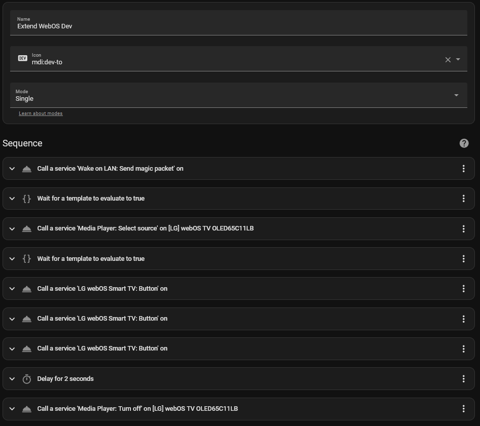
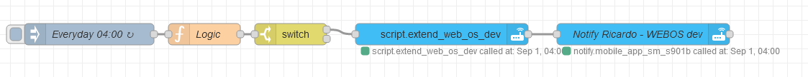
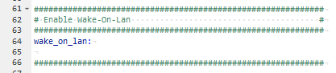

# LGAutoRenewDeveloperMode
Home assistant script to automatically renew the developer mode on WebOS

LG Developer mode allow us to instal multiple external apps that arent available in the LG store.
the main drowabck is that LG only allow the developer mode active for a certain amount of time, before was 50h, now they have changed it to 999h (~41 days).

This value can be extended at any time in the tv but must be manual, this created the issue that multiple time i forgot to extend and lost access to all the custom installed apps.
To avoid this i build this script with junction with node red to automatically extend every day.
The main disadvantage of this script is that we have to turn on the TV and do the actions to navigate the menus.

## Home Assistant Script:

**Process**:
- Send a Wake on Lan Package to the TV to turn it on
- Wait 10 secconds for TV turn on
- Change the TV Source to the "Developer Mode" chanel
- Wait 10 secconds for the Source to Load
- Call the service to press the "Remote Control button DOWN" two times
- Call the service to press the "Remote Control button ENTER" one time
- Wait 2 secconds
- Call the Service to turn the TV off.

Import the autoextend.yaml to the Home Assintant Scripts.

_Note: Do not to Forget to select you device in the script as currently is pointing to my device id (media_player.lg_webos_tv_b944)_

Example:



## Script Triggering
This script will be call by a NodeRed flow every day 1 of each month at 4AM.

**NodeRed Process**:
- Every day at 4 AM tiggers the flow
- Parses the DateTime and checks if is the first day of the month
- If is the first day of the month it trigger the Script
- (optional) sends a notification to my mobile device


Import the nodeRedFlow.json to the NodeRed.

_Note: Do not to Forget to select you devices in the script as currently is pointing to my devices_


Example:




## Requirements:

Already having the [Developer Mode app](https://webostv.developer.lge.com/develop/getting-started/developer-mode-app#installing-developer-mode-app)  in the TV and a [LG developer accout](https://webostv.developer.lge.com/develop/getting-started/preparing-lg-account)


Having the wake on Lan to the Home Assistant configuration.yaml

Add the following in your configuration.yaml
 ```yaml
    wake_on_lan:
```


